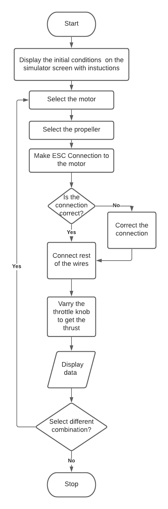
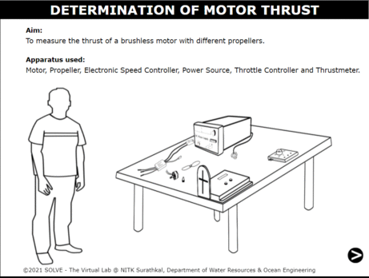

## Storyboard (Round 2)

Experiment: Determination of motor thrust

**1. Story Outline**: 
 
	This experiment highlights the method of estimating the motor thrust using a thrust meter. In the interface, the brief definition of the equipment is provided. On clicks, the equipments are placed. Then the user will select the motor as well as the propeller. Later on, the wiring connections needs to be done. Once it is completed, the power is switched on and the throttle is adjusted to the required values. At the end, a table of the values will be displayed. The initial interface gives the scaling of the experiment with respect to the human.

 **2. Story**:

  **2.1 Set the visual stage description**:

  The start up page shows all the equipments that will be used for this experiment. The user needs to click on the equipment name in order to get the details of it and place it on the table. Once all the equipments are placed, the type of motor to be used as well as the propeller needs to be selected. Later on the electrical connection needs to be done in order. On completion of the circuit, DC power supply needs to be switched on and the  speed can be adjusted by clicking on the throttle knob. The RPM values as well as the thrust can be seen in the comment box. The user can select another motor propeller combination in order to compare.

  **2.2 Set User Obectives & Goals**: 
<li>The primary objective of the experiment is to find the  thrust of the motor.</li>
<li>To understand the experiment setup  and the electric connections.</li>
<li>To infer how the thrust changes for the different propellers.</li>

  **2.3 Set the pathway activities** 
	<ol type=1>
	<li>Initially, the simulator consists of aim and there is an ARROW button to “start the simulation”.</li>
	<li>Click on the ARROW to continue.</li>
  <li>Place all the equipment with the clicks.</li>
  <li>Then, select the motor. Once it has been done, select the propeller.</li>
  <li>Click on the wires to make connections.</li>
  <li>Turn on the DC power supply.</li>
</ol>

  **2.4 Set Challenges and Questions/Complexity/variation**

  **2.4.a Questions before simulation**:

1. What does UAV stand for  <ol type=a><li>Unmanned Aerial Vehicle</li> <li>Unmanned Aircraft Vehicle </li><li>Utility Aerial Vehicle</li> <li>Utility Aircraft Vehicle</li></ol>
Answer a
2. The distance a propeller would move in one revolution if it were moving through a soft solid, like a screw through wood is the <ol type=a><li>Blade angle</li><li>Pitch</li><li>Chord</li><li>None of the above</li></ol>
Answer b
3. Kv in motor specification stands for <ol type=a><li>KiloVolt</li><li>Number of revolutions per volt<li>Both</li><li>None of the above</li>  </ol>
Answer b

**2.4.b Questions after simulation**

1. Equipment used to measure the thrust is <ol type=a><li>Thrustmeter</li><li>Tachometer</li><li>Both</li><li>None</li></ol>
Answer a
2. When the RPM of the motor is increased, <ol type=a><li>Thrust remains same </li><li>Thrust increases</li> <li>Thrust decreases</li> <li>None of the above</li> </ol>Answer b
3. When the propeller diameter decreases  <ol type=a><li>Thrust remains same <li>Thrust increases</li> <li>Thrust decreases </li><li>None of the above</li></ol>
Answer c

**2.5 Allow pitfalls:**\
 Improper connection of circuits will ask for the correction.

**2.6 Conclusion**:

The student approximately needs 3 minutes to answer the formative assessment questions, following which the simulation will take about 5min for each trials.
This experiments highlights the setup as well as the method for estimating the motor thrust using a thrustmeter. Also, the moment the student clicks on the answer of his choice, the CORRECT ANSWER should be displayed below the question. This would enable the student to understand whether he is right or wrong there itself.

**2.7 Equations/formulas:**

NA

**3. Flowchart**:

**4. Mindmap**:

**5. storyboard**:
1. In simulation window the experimental setup for determination of motor thrust is shown in isometric view.

2. The information about the experimental setup is given as you hover over the experimental setup.

3. Compare with different propeller combinations.

**6. References**:

<li>https://store-en.tmotor.com/category.php?id=64 </li>
<li>https://emaxmodel.com/</li>
